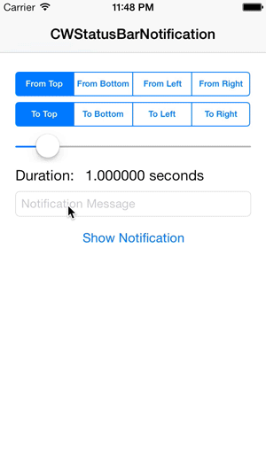

# CWStatusBarNotification

[](https://travis-ci.org/cezarywojcik/CWStatusBarNotification)

**NOTE:** You can find a `Swift` implementation of this library [in the swift branch of this repo](https://github.com/cezarywojcik/CWStatusBarNotification/tree/swift).

`CWStatusBarNotification` is a library that allows you to easily create text-based notifications that appear on the status bar.



## Requirements

`CWStatusBarNotification` uses ARC and requires iOS 7.0+.

Works for iPhone and iPad.

## Installation

### CocoaPods

`pod 'CWStatusBarNotification', '~> 2.2.0'`

### Manual

Copy the folder `CWStatusBarNotification` to your project.

## Usage

***Note:** The previous version of this library implemented the notifications using a category. This version uses an object instead.*

Firstly, you need the following import statement:

```objc
#import "CWStatusBarNotification.h"
```

Now, you need to create a `CWStatusBarNotification` object. It is recommended that you do so by attaching it as a property to a `UIViewController`.

```objc
CWStatusBarNotification *notification = [CWStatusBarNotification new];
```

After you have a `CWStatusBarNotification` object, you can simply call the `displayNotificationMessage:forDuration:` method:

```objc
[self.notification displayNotificationWithMessage:@"Hello, World!"
                   forDuration:1.0f];
```

If you prefer to manually choose when to display and dismiss the notification, you can do so as well:

```objc
[self.notification displayNotificationWithMessage:@"Hello" completion:nil];
// wait until you need to dismiss
[self.notification dismissNotification];
```

### Behavior on Tap

The default behavior when the notification is tapped is to dismiss it. However, you can override this behavior by setting the `onTapNotification` block to something different. 

For example:

```objc
self.notification.notificationTappedBlock = ^(void) {
    NSLog(@"notification tapped");
    // more code here
};
```

Note that overriding this block means that the notification will no longer be dismissed when tapped. If you want the notification to still dismiss when tapped, make sure to implement the following when overriding the block:

```objc
__weak typeof(self) weakSelf = self;
self.notification.notificationTappedBlock = ^(void) {
    if (!weakSelf.notificationIsDismissing) {
        [weakSelf dismissNotification];
        // more code here
    }
};
```

## Customizing Appearance

First of all, you can customize the background color and text color using the following properties: `notificationLabelBackgroundColor` and `notificationLabelTextColor`.

Example:

```objc
notification.notificationLabelBackgroundColor = [UIColor blackColor];
notification.notificationLabelTextColor = [UIColor greenColor];
```


The default value of `notificationLabelBackgroundColor` is `[[UIApplication sharedApplication] delegate].window.tintColor`.

The default value of `notification.notificationLabelTextColor` is `[UIColor whiteColor]`.

Finally, you can also choose from two styles - a notification the size of the status bar, or a notification the size of the status bar and a navigation bar. Simply change the `notificationStyle` property of the `CWStatusBarNotification` object to either `CWNotificationStyleStatusBarNotification` or `CWNotificationStyleNavigationBarNotification`.


The default value of `notificationStyle` is `CWNotificationStyleStatusBarNotification`.

## Customizing Animation

There are two properties that determine the animation style of the notification: `notificationAnimationInStyle` and `notificationAnimationOutStyle`. Each can take on one of four values:

* `CWNotificationAnimationStyleTop`
* `CWNotificationAnimationStyleBottom`
* `CWNotificationAnimationStyleLeft`
* `CWNotificationAnimationStyleRight`

The `notificationAnimationInStyle` describes where the notification comes from, whereas the `notificationAnimationOutStyle` describes where the notification will go.

The default value for `notificationAnimationInStyle` is `CWNotificationAnimationStyleTop`.

The default value for `notificationAnimationOutStyle` is `CWNotificationAnimationStyleTop`.

## Presenting a Custom View

As of version `2.2.0`, you can choose to present a custom view in lieu of presenting a simple message. The demo project shows a simple way in which you can make a custom NIB file and present it as the notification view using the `displayNotificationWithView:forDuration:` method:

```objc
UIView *view = [[NSBundle mainBundle] loadNibNamed:@"CustomView" owner:nil options:nil][0];
    [self.notification displayNotificationWithView:view forDuration:self.sliderDuration.value];
```
   
You can also display the notification and choose when to dismiss it as usual:

```objc
[self.notification displayNotificationWithView:view completion:nil];
// wait until you need to dismiss
[self.notification dismissNotification];
```


### Additional Remarks

The notifications will work in both screen orientations, however, screen rotation while a notification is displayed is not yet fully supported.

## Apps Using This Library

If you would like for your app to be featured here, [contact me](cezarywojcik.com/contact) and I would love to hear about your app!

* [SlideShare Presentations](https://itunes.apple.com/app/id917418728)
* [Pong Ping](https://itunes.apple.com/us/app/pong-ping-social-addictive/id822887888)
* [NextMovies](https://itunes.apple.com/us/app/nextmovies-smart-movie-recommendation/id680850329)

## License

    The MIT License (MIT)

    Copyright (c) 2014 Cezary Wojcik <http://www.cezarywojcik.com>

    Permission is hereby granted, free of charge, to any person obtaining a copy
    of this software and associated documentation files (the "Software"), to deal
    in the Software without restriction, including without limitation the rights
    to use, copy, modify, merge, publish, distribute, sublicense, and/or sell
    copies of the Software, and to permit persons to whom the Software is
    furnished to do so, subject to the following conditions:

    The above copyright notice and this permission notice shall be included in
    all copies or substantial portions of the Software.

    THE SOFTWARE IS PROVIDED "AS IS", WITHOUT WARRANTY OF ANY KIND, EXPRESS OR
    IMPLIED, INCLUDING BUT NOT LIMITED TO THE WARRANTIES OF MERCHANTABILITY,
    FITNESS FOR A PARTICULAR PURPOSE AND NONINFRINGEMENT. IN NO EVENT SHALL THE
    AUTHORS OR COPYRIGHT HOLDERS BE LIABLE FOR ANY CLAIM, DAMAGES OR OTHER
    LIABILITY, WHETHER IN AN ACTION OF CONTRACT, TORT OR OTHERWISE, ARISING FROM,
    OUT OF OR IN CONNECTION WITH THE SOFTWARE OR THE USE OR OTHER DEALINGS IN
    THE SOFTWARE.
